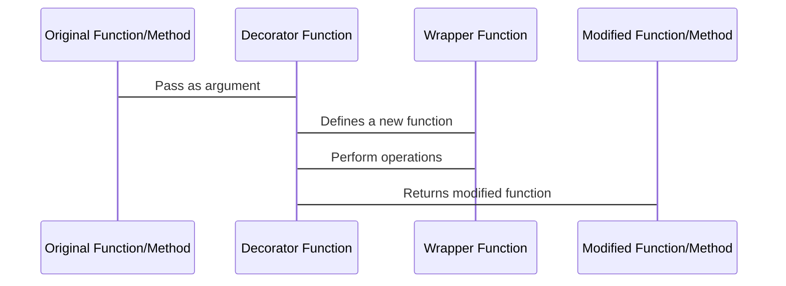

## Ask yourself these and see if you can answer this to your friend:

1. What is a class in Python?
2. What is an object in Python?
3. How do you create a class in Python?
4. How do you create an object in Python?
5. What is the difference between a class and an object?
6. What are class variables and instance variables?
7. What is the purpose of a constructor in a class?
8. What is the self keyword in Python?
9. How do you define a method in a class?
10. How do you inherit from one class to another in Python?
11. What is encapsulation in OOP?
12. What are the magic methods in Python and what are they used for?
13. How do you override a built-in method in Python?
14. Give an example of how you would use OOP to model a real-world problem.

## Explore more by R&D:

1. What is multiple inheritance in Python?
2. How do you achieve multiple inheritance in Python?
3. What is the method resolution order (MRO) in Python?
4. How does Python handle conflicts when multiple inheritance is used?
5. How does the diamond problem in multiple inheritance impact the MRO in Python?
6. How can you use the super() function in a multiple inheritance scenario?
7. How does Mixin class concept work in Python?
8. Give an example of how you would use multiple inheritance to model a real-world problem.
9. How does multiple inheritance impact the encapsulation in OOP?
10. What are the advantages and disadvantages of using multiple inheritance?

## Here are some reference links related to the topics we discussed:

1. Python Classes and Objects: [https://www.w3schools.com/python/python_classes.asp](https://www.w3schools.com/python/python_classes.asp)
2. Python Constructors: [https://www.w3schools.com/python/python_constructors.asp](https://www.w3schools.com/python/python_constructors.asp)
3. Python Inheritance: [https://www.w3schools.com/python/python_inheritance.asp](https://www.w3schools.com/python/python_inheritance.asp)
4. Python Method Overriding: [https://www.w3schools.com/python/python_method_overriding.asp](https://www.w3schools.com/python/python_method_overriding.asp)
5. Python Magic Methods: [https://www.geeksforgeeks.org/magic-methods-python/](https://www.geeksforgeeks.org/magic-methods-python/)
6. Python Multiple Inheritance: [https://www.geeksforgeeks.org/multiple-inheritance-python/](https://www.geeksforgeeks.org/multiple-inheritance-python/)
7. Mixins in Python: [https://en.wikipedia.org/wiki/Mixin](https://en.wikipedia.org/wiki/Mixin)
8. Method Resolution Order (MRO) in Python: [https://www.python.org/download/releases/2.3/mro/](https://www.python.org/download/releases/2.3/mro/)
9. Python super() function: [https://www.geeksforgeeks.org/super-in-python/](https://www.geeksforgeeks.org/super-in-python/)

# Decorators in Python

-   Decorators in Python are a way to modify or extend the behavior of a function or class without modifying its source code.
-   They are typically implemented as a wrapper function that takes the original function or class as an input, performs some operation on it, and then returns the modified function or class.
-   Decorators are applied to functions or methods using the "@" symbol followed by the decorator function name, immediately preceding the definition of the function or method to be decorated.
-   They can take arguments to customize the behavior of the decorated function or method.
-   Some examples of built-in decorators in Python include `@property`, `@classmethod`, `@staticmethod`, `@abstractmethod`.
-   They can be used for adding functionality such as logging, authentication, timing, etc. to functions or methods without cluttering the code.

-   The original function or method is defined and passed as an argument to the decorator function.
-   The decorator function defines a new wrapper function that takes the same arguments as the original function or method.
-   The wrapper function performs some operation on the original function or method, such as logging, authentication, timing, etc.
-   The modified function or method is returned by the decorator function.
-   The modified function or method can be called like the original function or method, but now it also includes the added functionality provided by the decorator.
